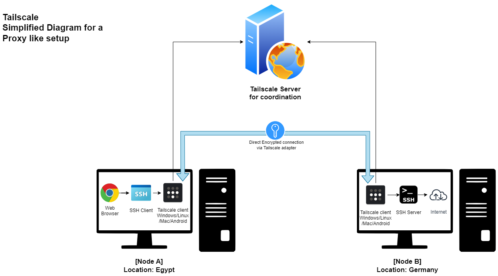
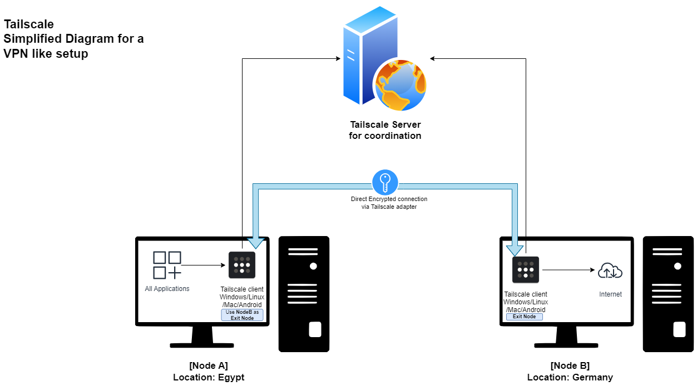
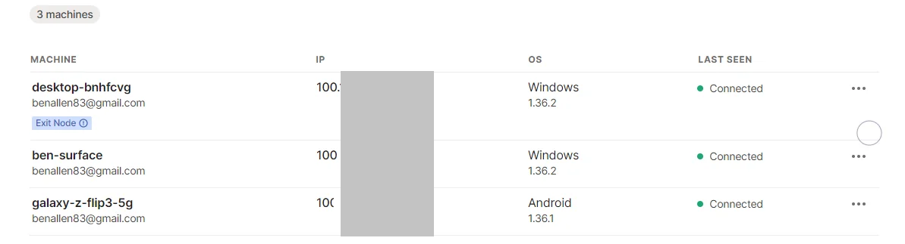

# Use Tailscale as a Self-hosted VPN
Tailscale is a Zero-config service which prodives a software-defined mesh virtual private network.
In this document, 2 ways will be explained to use tailscale as VPN.

## Requirements
- OS: Windows/Linux/Mac/Android/iOS
- Internet connection
- 2 Machines
  - One as a client (located where a VPN is needed to unblock the traffic)
  - One act as a server (located where traffic has no restrictions)

## Network Setup
- Node A: is a tailscale client located in Egypt
- Node B: is a tailscale client located in Germany

## Installation
1. Create account on [Tailscale SignUp](https://login.tailscale.com/start)
1. Install [Tailscale client](https://tailscale.com/download) on Node A and Node B
1. Login on each node using your account
1. Now you should see that your 2 Devices are `Connected` at the online tailscale dashboard.
## Tailscale as a SOCKS Proxy [Forward Web Browser traffic from NodeA to NodeB]

### Node B [Germany]
- Setup SSH Server on NodeB
    - [Windows](https://github.com/PowerShell/Win32-OpenSSH/wiki/Install-Win32-OpenSSH-Using-MSI)
    - Linux: most probably this is already setup on your machine but here is the instructions anyway
      - [Ubuntu](https://ubuntu.com/server/docs/service-openssh)
      - [Arch](https://wiki.archlinux.org/title/OpenSSH)

### Node A [Egypt]
1. Right click on Tailscale systray icon and choose `Network Devices` -> `My Devices` then choose NodeB name in the list. this will copy NodeB IP to your clipboard.
1. Now SSH to NodeB machine. example `ssh -N -C -D 10451 UserName@NodeB_IP`
    ```
    -N       Do not execute a remote command. This is useful for just forwarding ports.
    -C       Requests compression of all data
    -D       Specifies a local ''dynamic'' application-level port forwarding.
             Enable SOCKS4/5 Port.
    10451    you can change this port to whatever suits you
    UserName userName of an account on NodeB
    NodeB_IP The IP of NodeB from tailscale dashboard
    ```
1. Setting up the browser:
    - Edge/Chrome:
      - Launch chrome using the flag `--proxy-server="socks5://localhost:10451"`
    - Firefox:
      - Open Settings
      - Under `General` page, scroll down to `Network Settings` then click on `Settings`
      - Choose `Manual Proxy Configuration`
      - Under `SOCKS`
        - Host: `localhost`
        - Port: `10451`

## Tailscale as a VPN [Forward all traffic from NodeA to NodeB]

### Node B [Germany]
1. Right click on Tailscale systray icon and choose `Exit Node` then choose `Run Exit Node ..`
1. Go to the [online dashboard](https://login.tailscale.com/admin/machines) and confirm the Exit node for NodeB machine.
1. Now this machine is ready to forward the received traffic from NodeA to the internet.
### Node A [Egypt]
1. Right click on Tailscale systray icon and choose `Exit Node` then choose NodeB name in the list.
1. Now all of your traffic from NodeA will be forwarded through NodeB which act as `Exit Node`

> [!CAUTION]
> All traffic including **TORRENTS** will be forwarded through this connection. take care to watch
your internet usage so you don't get **fined by the ISP of NodeB!**


## Tailscale Dashboard
This is how the dashboard looks like when you have 3 tailscale clients, one of them used as `Exit Node`.
